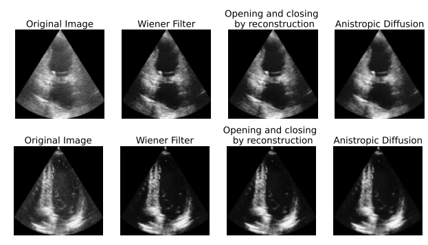
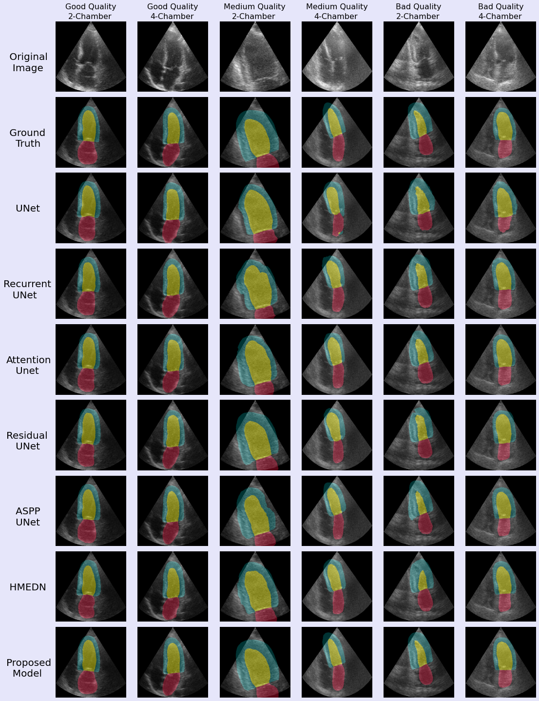

# TC-SegNet
A robust deep learning framework for segnmentation of 2D echocardiography.

## Description

[Dataset Link and Description](https://www.creatis.insa-lyon.fr/Challenge/camus/databases.html)
**MODELS USED**
- UNet(UNet)
- [Recurrent U-Net](https://doi.org/10.1109/ICCV.2019.00223) (R2UNet)
- [Attention U-Net](https://arxiv.org/abs/1804.03999) (Attn_Unet)
- [Residual Unet](https://doi.org/10.1109/LGRS.2018.2802944) (ResUnet)
- [ASPP UNet](https://www.sciencedirect.com/science/article/abs/pii/S0925231220303374?via%3Dihub)
- [HMEDN](https://doi.org/10.1109/TIP.2019.2919937)
- **TC-SegNet** (model = ResUnetPlusPlus_Path)

## Usage

## Results
**Pre Processing** 
 

**Segmentation Output** 
 
